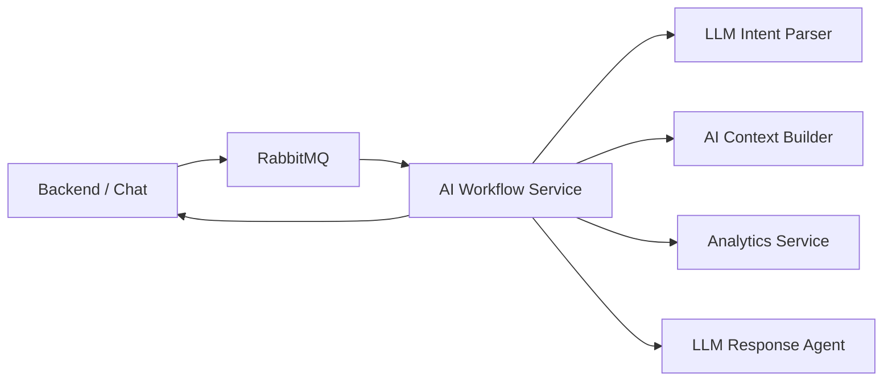

# AI Financial Assistant — Monorepo сервисов

Monorepo AI-конвейера финансового ассистента: оркестрация workflow, парсинг намерений, сбор контекста, аналитика и генерация ответа.

Зависимости управляются через [uv](https://docs.astral.sh/uv/) (`pyproject.toml` + `uv.lock` в каждом сервисе).

## Назначение

Система принимает сообщение пользователя из Backend / Chat Service, проходит через цепочку специализированных AI-сервисов и возвращает финансовый ответ. Каждый сервис отвечает за одну зону ответственности.

## Архитектура



Асинхронный вход — через RabbitMQ (очередь `ai.workflow.tasks`). Синхронные HTTP-вызовы между сервисами выполняет AI Workflow Service.

## Границы сервисов

- **AI Workflow Service** — только оркестрация (LangGraph), без бизнес-логики downstream-сервисов
- **LLM Intent Parser** — понимает запрос пользователя, возвращает структурированный intent
- **AI Context Builder** — готовит нормализованные данные и context package
- **Analytics Service** — считает финансовые факты по execution plan
- **LLM Response Agent** — формирует финальный ответ пользователю
- LLM **не выполняет** финансовые расчёты; Response Agent **не пересчитывает** аналитику

## Стек

| Компонент | Использование |
|-----------|---------------|
| Python 3.12 | Все сервисы |
| FastAPI | HTTP API |
| uv | Управление зависимостями и запуск |
| Pydantic | Контракты и валидация |
| RabbitMQ | Асинхронная доставка задач |
| LangGraph | Оркестрация workflow (только ai-workflow-service) |
| LangChain | Intent Parser (Response Agent — в планах) |
| Docker Compose | Локальный dev-стенд |
| nginx | Dev gateway на порту 8080 |

## Структура monorepo

```text
ai-workflow/
├── ai-workflow-service/          # оркестратор
├── llm-intent-parser-service/    # парсинг намерений
├── ai-context-builder-service/   # сбор контекста
├── analytics-service/            # финансовая аналитика
├── llm-response-agent-service/   # генерация ответа
├── packages/
│   ├── shared_contracts/         # общие Pydantic-модели
│   ├── shared_http/              # HTTP-клиент с retry
│   ├── shared_logging/           # общий логгер
│   └── shared_config/            # базовые настройки
├── infra/                        # RabbitMQ, nginx
├── docker-compose.dev.yml
└── Makefile
```

## Сервисы

| Сервис | Порт | Основной API |
|--------|------|--------------|
| ai-workflow-service | 8010 | `POST /api/v1/workflow/run`, `/enqueue`, `/run/debug` |
| llm-intent-parser-service | 8011 | `POST /api/v1/intent/parse` |
| ai-context-builder-service | 8012 | `POST /api/v1/context/build` |
| analytics-service | 8013 | `POST /api/v1/analytics/run` |
| llm-response-agent-service | 8014 | `POST /api/v1/response/generate` |

Дополнительно: RabbitMQ (5672, management UI 15672), nginx (8080).

## Требования

Установите [uv](https://docs.astral.sh/uv/getting-started/installation/).

## Быстрый старт (локально)

```bash
cd ai-workflow-service   # или любой другой сервис
uv sync
uv run uvicorn app.main:app --reload --host 0.0.0.0 --port 8010
uv run pytest
uv run ruff check .
```

Команды monorepo:

```bash
make sync    # uv sync во всех сервисах
make lock    # uv lock во всех сервисах
make test    # pytest во всех сервисах + shared_contracts
```

## Docker

```bash
cp .env.example .env
make dev-up
```

Каждый образ собирается через `uv sync --frozen --no-dev` и запускается через `uv run`.

Логи:

```bash
make logs
make logs-ai-workflow-service
```

## Текущая стадия реализации

| Компонент | Статус | Что есть |
|-----------|--------|----------|
| **ai-workflow-service** | Готово (ядро) | LangGraph-граф, RabbitMQ consumer/publisher, HTTP API, HTTP-клиенты к downstream, clarification routing, debug runner, mock Backend Chat |
| **llm-intent-parser-service** | Готово (ядро) | LangChain pipeline, mock и openai_compatible провайдеры, валидация intent, clarification, ~60+ тестов |
| **ai-context-builder-service** | Заглушка | FastAPI + схемы + каркас модулей; `POST /context/build` возвращает stub |
| **analytics-service** | Заглушка | FastAPI + каркас functions/engine; `POST /analytics/run` возвращает stub; реализован `safe_divide` |
| **llm-response-agent-service** | Dev-stub | `POST /response/generate` возвращает шаблонный текст без LLM; pipeline/agents в TODO |
| **packages/shared_contracts** | Готово | Общие Pydantic-контракты + тесты |
| **packages/shared_http** | Готово | HTTP-клиент с retry (используется workflow) |
| **packages/shared_logging** | Каркас | Не подключён в сервисах |
| **packages/shared_config** | Каркас | Не используется сервисами |

E2E-поток: оркестрация workflow работает end-to-end; downstream-сервисы пока отдают заглушки, финальный ответ — dev-stub текст.

Подробнее по каждому сервису — в его `README.md`.
